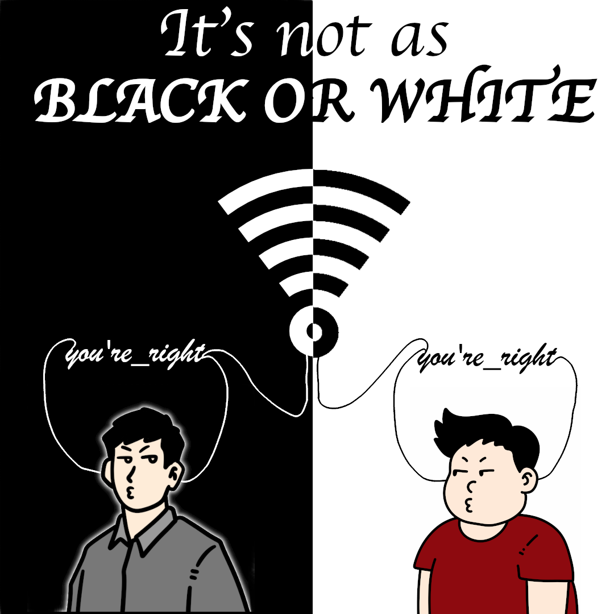

# Echo Chambers: Who's Right? Hint: It’s no one

## Introduction
For this visual argument, I wanted to force people to think critically for what they see on the internet. Of course, many people at this point know that they cannot easily believe everything they see on the internet, but the issue lies a bit deeper than that. This is where echo chambers come into play. An echo chamber is where people are fed the same information that they already believe in, which strengthens in their belief. However, I believe that is important for people to see conflicting information and to challenge beliefs in order to critically think. It can also help to strengthen their own argument as they can evaluate counter examples. 

But another issue is when people are constantly fed information, sometimes this is how false information is spread. If something is false, the search engines will continue to try to find content that you will engage with more and then feed that to you first before other suggestions. Why does this happen?

Because that is how revenue can be generated. Keeping a user engaged for longer means more money depending on ads and stuff. If a user believes in something, the user is more likely to stay and engage with that content, rather if you say something the user won’t believe, they may just click off automatically. There is a lack of content that continuously challenges beliefs, which makes it hard for users to feed into that content.

## Creative Process
I wanted to take a very “black and white” approach (literally and figuratively). The stark contrast between the black and white should be jarring to the user however also pleasing to the eye as the images flip. The only source of actual color is in the cartoon people at the bottom, which should lead their eyes next. This creates contrast as well as a little bit of visual rhythm as things are repeated. The image on the left and right are the same, however it is able to depict that they are on opposing sides, but being fed that they are still right. 

I utilized the select tool quite a bit to get the black and white contrast for the background. I also used it to create backgrounds for the WiFi to create the contrasting image colors. One select tool I used was the fuzzy select tool. This allowed me to remove the background of the man on the left since it was white before. It was really easy and I was able to get the effect I wanted. Another tool I used a lot was the move tool as well as the text tool, which are some more obvious ones. I did play around with the invert tool to get the white and black to flip. 

Without further ado, here's my visual argument.

# Sources
The following images were acquired from Vecteezy:

https://www.vecteezy.com/photo/29925839-cute-man-cartoon-on-white-background

https://www.vecteezy.com/photo/28864279-cartoon-happy-fat-man-on-white-background

The following image was designed by freepik:

https://www.freepik.com/icon/no-wifi_1199612

These images were free to use
